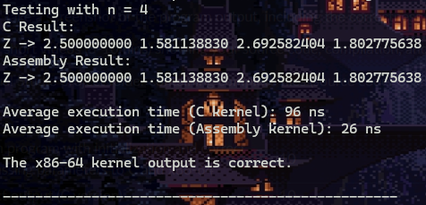

# C-Program calls Assembly Kernel

### The kernels of both programs calculates the distances between the coordinate points across two vectors with the formula:
## Z[i] = √((X₂[i] - X₁[i])² + (Y₂[i] - Y₁[i])²)

### C is the main caller which calls the Assembly Kernel

## Installation and Running

## Call the run.bat file in the CLI or alternatively write these commands:

```bash
nasm -f win64 -o mco2ASM.obj mco2ASM.asm
gcc -m64 -c mco2_.c -o mco2_.obj
gcc -m64 -o program_.exe mco2_.obj mco2ASM.obj -lgcc
program_.exe
```

# Analysis



| Size of Array |   C Runtime   | Assembly Runtime |
|:-------------:|:-------------:|:----------------:|
| $2^2$ |  96 ns   | 26 ns |
| $2^{20}$ |   26627703 ns (0.027 s)   | 1906993 ns (0.002 s) |
| $2^{24}$ |   438451423 ns (0.438 s)   | 31869366 ns (0.032 s) |
| $2^{25}$ |   898848306 ns (0.899 s)  | 63705433 ns (0.064 s) |
| $2^{26}$ |   1779488383 ns (1.779 s)   | 132754076 ns (0.133 s) |

### The algorithm uses a straighforward formula where each element is Z is a square root of the addition (X2-X1) squared and (Y2-Y1) squared, or basically the distance formula of two points across vectors. The times recorded are an average result of running it 30 times and each test became progressively longer to accomplish. As the array size increases, the C runtime grows rapidly, especially for sizes like 2^24 and 2^26, where it reaches over a second. The assembly implementation shows a much more consistent and efficient growth compared to the C runtime. For larger arrays, assembly performs significantly better, with runtimes being up to 50 times faster than the C counterpart for sizes like 2^26. The program was able to finish until 2^26, however 2^27 simply could not finish and the program stopped on its own, possibly dependent on the device being used to test.
